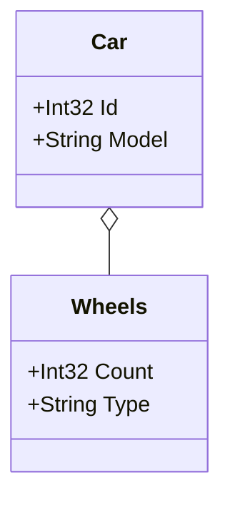

# Mermaid Class Diagram Generator

Effortlessly generate stunning Mermaid.js class diagrams from your C# models and export them to Markdown


## Contents
1. [🛠️ Features](#%EF%B8%8F-features)  
2. [📦 Installation](#-installation)
3. [🚀 Usage](#-usage)
   - [Steps](#steps)
   - [Basic Example](#basic-example)
   - [Parameters](#parameters)
   - [Example Output](#example-output)  
4. [🔍 Advanced Examples](#-advanced-examples)
5. [📜 License](#-license)  
6. [🙏 Contributing](#-contributing)
7. [📫 Contact](#-contact)

## 🛠️ Features

### Automatic Diagram Generation:
The Mermaid Class Diagram Generator automatically generates class diagrams based on your .NET code. 

### Markdown Export:
The Mermaid Class Diagram Generator outputs diagrams as `.md` files with [Mermaid.js](https://mermaid.js.org/) syntax, perfect for README files and other Markdown-supported documentation platforms.

> **What is Mermaid.js?**  
> Mermaid.js is a JavaScript-based library for creating diagrams in Markdown. [Learn more about Mermaid.js.](https://mermaid-js.github.io/)

### Recursive Documentation:
The Mermaid Class Diagram Generator works recursively to map out relationships between types. When you pass a type to the generator, it automatically includes:
- Properties and their types: Each property is documented, and its type is explored. If a property itself has properties, those are documented as well.
- Inheritance: If the type has inheritors (or inheritors of inheritors), these relationships are included.

To avoid overly complex diagrams, you can use the Exclude Attribute to break the recursion. Types marked with this attribute will not be included in the diagram, simplifying the output when necessary.

This recursive behavior ensures a complete and detailed overview of your domain while remaining flexible for customization.

### Easy Configuration:
Simple setup with configurable parameters to specify assemblies and domain types.

## 📦 Installation

You can install the `MermaidClassDiagramGenerator` NuGet package via the .NET CLI or through Visual Studio's NuGet Package Manager.

### Using .NET CLI

```bash
dotnet add package MermaidClassDiagramGenerator
```

### Using Package Manager Console

```powershell
Install-Package MermaidClassDiagramGenerator
```

### Using .NET CLI with Specific Version
```bash
dotnet add package MermaidClassDiagramGenerator --version x.y.z
```
Replace x.y.z with the desired version number.

## 🚀 Usage

The easiest way to use MermaidClassDiagramGenerator is by adding it to a console application within your solution.

### Steps:
1. **Create a Console App:**
   - In your solution, add a new Console App project where you will use the generator.
3. **Install the Package:**
   - Install MermaidClassDiagramGenerator via NuGet as shown above.
3. **Implement the Generator:**
   - Use the following example to set up and generate your class diagram.

### Basic Example:
```cs
using System;
using System.Collections.Generic;
using System.Reflection;
using MermaidClassDiagramGenerator;

namespace YourNamespace
{
    class Program
    {
        static void Main(string[] args)
        {
            var generator = new DiagramGenerator(
                outputFilePath: "diagram.md",
                assembliesToScan: new List<Assembly> { Assembly.GetExecutingAssembly() },
                domainTypes: new List<Type> { typeof(Car), typeof(Wheels) },
                generateWithoutProperties: false
            );
            
            generator.Generate();

            Console.WriteLine("Mermaid.js class diagram generated successfully at diagram.md");
        }
    }

    // Example domain classes
    public class Car
    {
        public int Id { get; set; }
        public string Model { get; set; }
        public Wheels Wheels { get; set; }
    }

    public class Wheels
    {
        public int Count { get; set; }
        public string Type { get; set; }
    }
}

```

### Parameters:
- **outputFilePath (`string`)**: The file path where the generated Mermaid.js diagram will be saved. Important: The file must have a .md extension as the generator outputs the diagram in Markdown format, which supports Mermaid.js syntax.
- **assembliesToScan (`IEnumerable<Assembly>`)**: A collection of assemblies that the generator will scan to discover domain classes. These assemblies should contain the classes you want to include in the diagram.
- **domainTypes (`IEnumerable<Type>`)**: A list of domain class types that the generator should document. The generator processes these types recursively, meaning that if a domain class (e.g., Auto) has properties of other domain types (e.g., Wheels), those related types will also be included in the generated class diagram automatically.
- **generateWithoutProperties (`bool`)**: A boolean flag indicating whether to generate the class diagram without including property details. If set to true, the diagram will display class names without listing their properties.

### Example Output

After running the generator, your diagram.md might contain:


## 🔍 Advanced Examples
- [Exclude Classes from the Diagram](docs/exclude-attribute-example.md)

The next four examples cover common Domain-Driven Design (DDD) scenarios, such as working with entities and aggregate roots. They show how the generator’s recursive functionality can automatically discover related entities and their relationships, reducing the need to manually specify every type. For aggregates, you only need to pass the aggregate roots, and the generator will handle the rest.
- [Find Entities by Base Class](docs/entities-base-class.md)
- [Find Entities by Interface](docs/entities-interface.md)
- [Find Aggregate Roots by Base Class](docs/aggregate-root-base-class.md)
- [Find Aggregate Roots by Interface](docs/aggregates-root-interface.md)

## 📜 License

This project is licensed under the [MIT License](LICENSE).

## 🙏 Contributing

Contributions are welcome! Please open an issue or submit a pull request for any improvements or bug fixes.

## 📫 Contact

For any questions or support, please open an issue on the [GitHub repository](https://github.com/jespervandijk/mermaid-class-diagram-generator).

---
