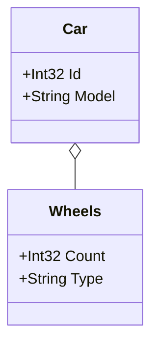

# Mermaid Class Diagram Generator

Effortlessly generate stunning Mermaid.js class diagrams from your C# domain models and export them to Markdown.

## 🛠️ Features

- **Automatic Diagram Generation:** Create class diagrams directly from your C# domain models.
- **Recursive Documentation:** Automatically includes related and nested types for comprehensive diagrams.
- **Markdown Export:** Outputs diagrams as `.md` files, perfect for README files and other Markdown-supported documentation platforms.
- **Easy Configuration:** Simple setup with configurable parameters to specify assemblies and domain types.

## 📦 Installation

You can install the `MermaidClassDiagramGenerator` NuGet package via the .NET CLI or through Visual Studio's NuGet Package Manager.

### Using .NET CLI

```bash
dotnet add package MermaidClassDiagramGenerator
```

### Using Package Manager Console

```powershell
Install-Package MermaidClassDiagramGenerator
```

### Using .NET CLI with Specific Version
```bash
dotnet add package MermaidClassDiagramGenerator --version x.y.z
```
Replace x.y.z with the desired version number.

## 🚀 Usage

The easiest way to use MermaidClassDiagramGenerator is by adding it to a console application within your solution.

### Steps:
1. **Create a Console App:**
   - In your solution, add a new Console App project where you will use the generator.
3. **Install the Package:**
   - Install MermaidClassDiagramGenerator via NuGet as shown above.
3. **Implement the Generator:**
   - Use the following example to set up and generate your class diagram.

### Basic Example:
```cs
using System;
using System.Collections.Generic;
using System.Reflection;
using MermaidClassDiagramGenerator;

namespace YourNamespace
{
    class Program
    {
        static void Main(string[] args)
        {
            var generator = new DiagramGenerator(
                outputFilePath: "diagram.md",
                assembliesToScan: new List<Assembly> { Assembly.GetExecutingAssembly() },
                domainTypes: new List<Type> { typeof(Auto), typeof(Wheels) },
                generateWithoutProperties: false
            );
            
            generator.Generate();

            Console.WriteLine("Mermaid.js class diagram generated successfully at diagram.md");
        }
    }

    // Example domain classes
    public class Car
    {
        public int Id { get; set; }
        public string Model { get; set; }
        public Wheels Wheels { get; set; }
    }

    public class Wheels
    {
        public int Count { get; set; }
        public string Type { get; set; }
    }
}

```

### Parameters:
- outputFilePath (string): The file path where the generated Mermaid.js diagram will be saved. Important: The file must have a .md extension as the generator outputs the diagram in Markdown format, which supports Mermaid.js syntax.
- assembliesToScan (IEnumerable<Assembly>): A collection of assemblies that the generator will scan to discover domain classes. These assemblies should contain the classes you want to include in the diagram.
- domainTypes (IEnumerable<Type>): A list of domain class types that the generator should document. The generator processes these types recursively, meaning that if a domain class (e.g., Auto) has properties of other domain types (e.g., Wheels), those related types will also be included in the generated class diagram automatically.
- generateWithoutProperties (bool): A boolean flag indicating whether to generate the class diagram without including property details. If set to true, the diagram will display class names without listing their properties.

## 📄 Example Output

After running the generator, your diagram.md might contain:


## Advanced Examples
- [Exclude Attribute](docs/exclude-attribute-example.md)
- [Document Entities with Inheritance](docs/entities-inheritance-example.md)
- [Document Entities with an Interface](docs/entities-interface-example.md)
- [Document Aggregates with Inheritance](docs/aggregates-inheritance-example.md)
- [Document Aggregates with an Interface](docs/aggregates-interface-example.md)

## 📜 License

This project is licensed under the [MIT License](LICENSE).

## 🙏 Contributing

Contributions are welcome! Please open an issue or submit a pull request for any improvements or bug fixes.

## 📫 Contact

For any questions or support, please open an issue on the [GitHub repository](https://github.com/jespervandijk/mermaid-class-diagram-generator).

---
