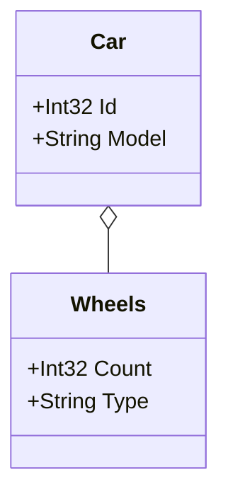

## Get Aggregates Using an Interface
This example uses the `ImplementsGenericInterface` extension method to gather classes that implement a generic interface, like `IAggregate<T>`.
This is useful when your aggregates implement a common interface. By passing only the classes implementing `IAggregate<T>` to the generator,
recursive scanning will include any related types automatically (e.g., `Wheels`), giving you a full diagram of the aggregate structure without needing to specify each component explicitly.

### Code:
```cs
var assembly = Assembly.GetExecutingAssembly();
var aggregateTypes = assembly.GetTypes().Where(type => type.ImplementsGenericInterface(typeof(IAggregate<>)))
    .ToList();

var generator = new DiagramGenerator(
    outputFilePath: "../../../Outputs/genericInterfaceExample.md",
    assembliesToScan: new List<Assembly> { assembly },
    domainTypes: aggregateTypes,
    generateWithoutProperties: false
);
    
generator.Generate();

Console.WriteLine("Mermaid.js class diagram generated successfully at genericInterfaceExample.md");

public interface IAggregate<T>
{
}

public class Car : IAggregate<Car>
{
    public int Id { get; set; }
    public string Model { get; set; }
    public Wheels Wheels { get; set; }
}

public class Wheels
{
    public int Count { get; set; }
    public string Type { get; set; }
}
```

### Output:

