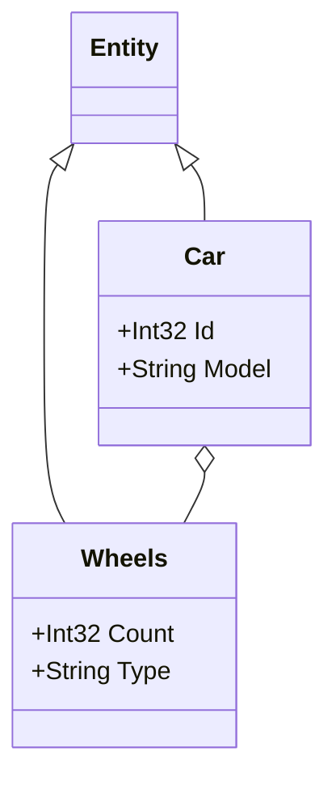

## Get All Entities with Inheritance
This example demonstrates using the `InheritsFrom` extension method to gather all classes that inherit from a base `Entity` class.
This approach is useful when your domain model consists only of entities, rather than aggregates, and you want to include all derived entities in the diagram.
By filtering for classes that inherit from Entity, you can ensure that only the relevant types are passed to the generator for a clear, focused representation of your domain.

### Code:
```cs
var assembly = Assembly.GetExecutingAssembly();
var entityTypes = assembly.GetTypes().Where(type => type.InheritsFrom(typeof(Entity)))
    .ToList();

var generator = new DiagramGenerator(
    outputFilePath: "../../../Outputs/inheritanceExample.md",
    assembliesToScan: new List<Assembly> { assembly },
    domainTypes: entityTypes,
    generateWithoutProperties: false
);
    
generator.Generate();

Console.WriteLine("Mermaid.js class diagram generated successfully at inheritanceExample.md");

public abstract class Entity
{
}

public class Car : Entity
{
    public int Id { get; set; }
    public string Model { get; set; }
    public Wheels Wheels { get; set; }
}

public class Wheels : Entity
{
    public int Count { get; set; }
    public string Type { get; set; }
}
```

### Output:

