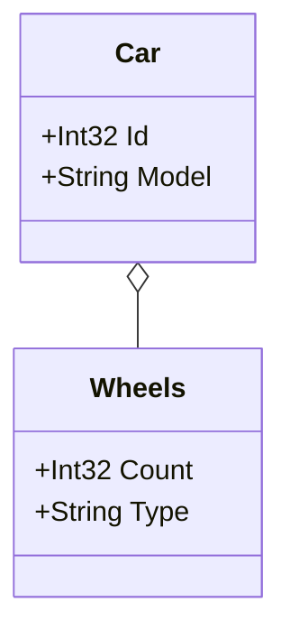

## Get All Entities with an Interface
This example uses the `Implements` extension method to gather all classes that implement an `IEntity` interface.
It’s helpful in domains where entities are defined by an interface rather than a base class.
By filtering for types that implement `IEntity`, you can ensure that only relevant, interface-based entities are included in the diagram, providing a clear view of the domain’s structure.

### Code:
```cs
var assembly = Assembly.GetExecutingAssembly();
var entityTypes = assembly.GetTypes().Where(type => type.Implements(typeof(IEntity)))
    .ToList();

var generator = new DiagramGenerator(
    outputFilePath: "../../../Outputs/implementsExample.md",
    assembliesToScan: new List<Assembly> { assembly },
    domainTypes: entityTypes,
    generateWithoutProperties: false
);
    
generator.Generate();

Console.WriteLine("Mermaid.js class diagram generated successfully at implementsExample.md");

public interface IEntity
{
}

public class Car : IEntity
{
    public int Id { get; set; }
    public string Model { get; set; }
    public Wheels Wheels { get; set; }
}

public class Wheels : IEntity
{
    public int Count { get; set; }
    public string Type { get; set; }
}
```

### Output:

