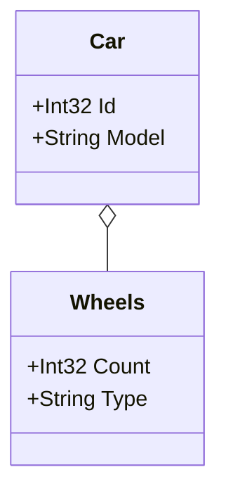

## Exclude Classes from the Diagram
This example shows how to exclude specific classes from the diagram using the `[ExcludeFromDiagram]` attribute.
This can be helpful when you have technical or base classes, such as `Aggregate<T>`, that are not part of the main domain and would clutter the diagram.

### Code:
```cs
var assembly = Assembly.GetExecutingAssembly();
var aggregateTypes = assembly.GetTypes().Where(type => type.InheritsFromGenericType(typeof(Aggregate<>)))
    .ToList();

var generator = new DiagramGenerator(
    outputFilePath: "../../../Outputs/excludeFromDiagram.md",
    assembliesToScan: new List<Assembly> { assembly },
    domainTypes: aggregateTypes,
    generateWithoutProperties: false
);
    
generator.Generate();
Console.WriteLine("Mermaid.js class diagram generated successfully at excludeFromDiagram.md");

[ExcludeFromDiagram]
public abstract class Aggregate<T>
{
}

public class Car : Aggregate<Car>
{
    public int Id { get; set; }
    public string Model { get; set; }
    public Wheels Wheels { get; set; }
}

public class Wheels
{
    public int Count { get; set; }
    public string Type { get; set; }
}
```

### Output:

