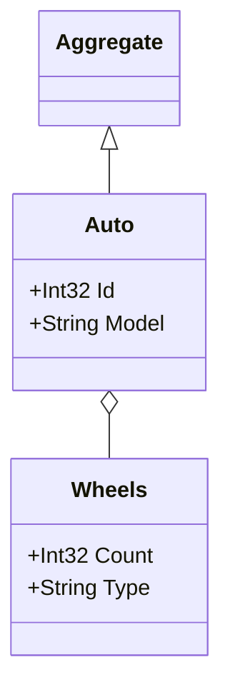

## Get Aggregates Using Inheritance
This example demonstrates using the `InheritsFromGenericType` extension method to gather all classes that inherit from a generic base type, such as `Aggregate<T>`.
This approach is useful when working with aggregate roots in your domain model.
You only need to pass the aggregate root types to the generator, and the recursive scanning will automatically include related types (e.g., `Wheels`) in the diagram, ensuring a complete representation of the aggregate and its components.

### Code:
```cs
var assembly = Assembly.GetExecutingAssembly();
        var aggregateTypes = assembly.GetTypes().Where(type => type.InheritsFromGenericType(typeof(Aggregate<>)))
            .ToList();
        
        var generator = new DiagramGenerator(
            outputFilePath: "../../../Outputs/genericInheritanceExample.md",
            assembliesToScan: new List<Assembly> { assembly },
            domainTypes: aggregateTypes,
            generateWithoutProperties: false
        );
            
        generator.Generate();

        Console.WriteLine("Mermaid.js class diagram generated successfully at genericInheritanceExample.md");

public abstract class Aggregate<T>
{
}

public class Auto : Aggregate<Auto>
{
    public int Id { get; set; }
    public string Model { get; set; }
    public Wheels Wheels { get; set; }
}

public class Wheels
{
    public int Count { get; set; }
    public string Type { get; set; }
}
```

### Output:

