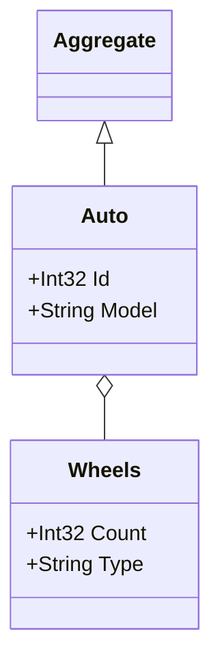

## Inherticance From Generic Type
This example handles classes that inherit from a generic base type, such as Aggregate<T>.
Using the InheritsFromGenericType extension method, it scans for types that derive from Aggregate<>, ensuring that only the relevant derived types are included in the diagram.
Note: Related classes (e.g., Wheels) will still appear in the output due to the recursive nature of the generator, capturing all nested and related types.

### Code:
```cs
var assembly = Assembly.GetExecutingAssembly();
        var aggregateTypes = assembly.GetTypes().Where(type => type.InheritsFromGenericType(typeof(Aggregate<>)))
            .ToList();
        
        var generator = new DiagramGenerator(
            outputFilePath: "../../../Outputs/genericInheritanceExample.md",
            assembliesToScan: new List<Assembly> { assembly },
            domainTypes: aggregateTypes,
            generateWithoutProperties: false
        );
            
        generator.Generate();

        Console.WriteLine("Mermaid.js class diagram generated successfully at genericInheritanceExample.md");

public abstract class Aggregate<T>
{
}

public class Auto : Aggregate<Auto>
{
    public int Id { get; set; }
    public string Model { get; set; }
    public Wheels Wheels { get; set; }
}

public class Wheels
{
    public int Count { get; set; }
    public string Type { get; set; }
}
```

### Output:

